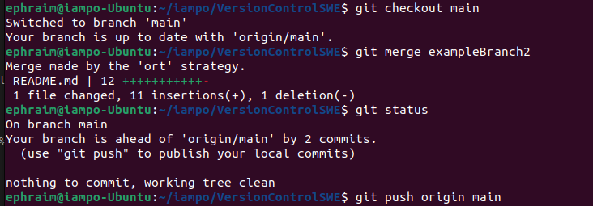
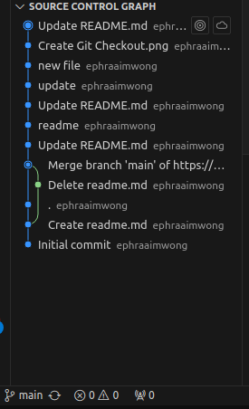
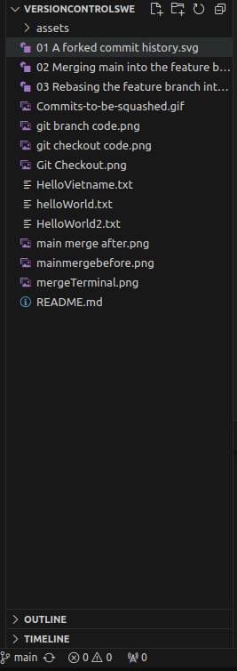
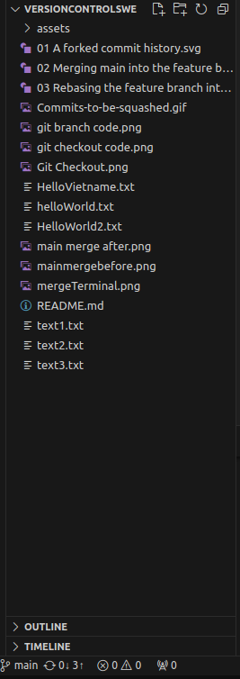
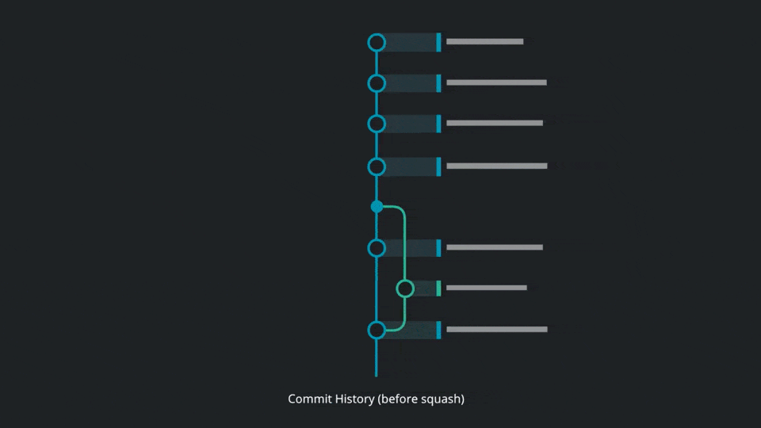

# Version Control 101

## Git Branches

### What is a branch????

Branchs are a pointer to a snapshot of your changes. A **new branch** should be spawned whenever features, fixes or any changes is to be added -- no matter how big or small. Branching allows you to encapsulate your changes and prevents unstable code to be merged into main easily.

### How work????

Branches represent independent lines of development which can be treated as a **brand spanking new repository** that commits can be made to!

Once coded to one's hearts content, the branch can be merged back to main for changes to be reflected.

### How Do???

Notice the * beside main, that signifies the HEAD pointer showing which branch is active!

## Git Merge!

### How Work?

Integrates entire history (all commits) of one branch into another. A "**merge commit**" is created. The version pointer of main then points to merged version.

### How DO???

1) Switch over to the **Target Branch** (Branch to be merged on) via `git checkout <target branch>`
2) Run `git merge <feaure branch>`

Before| After|
--|--|
|

## Git Rebase

### How Work?

Appends feature branch unto target branch, a linear sort of merging. The version of main becomes the start point where the feature branch is frankensteined unto.

### How DO???
1) Switch over to the target branch via `git checkout <target branch>`
2) Run `git rebase <feature branch>`

Before| After|
--|--|
|

## Git Squash
### How Work?
Conpressing multiple commits, even an entire branch into a single commit, therefore **SQUASH**.

 

### How DO?
Squash Merge
1) `git checkout <target branch>`
2) `git merge --squash <feature branch>`
3) `git commit -m "text here"`
4) `git push origin <target branch>`
